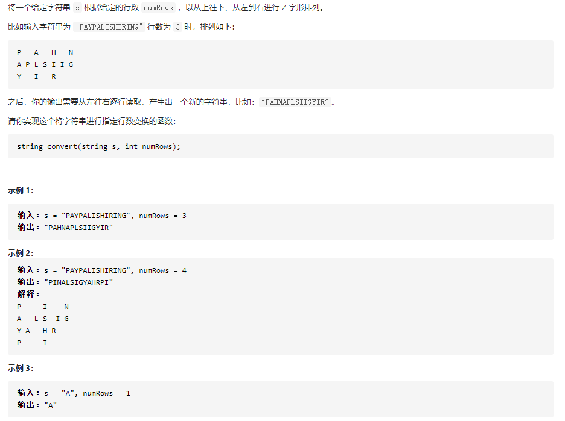

# [ Z 字形变换](https://leetcode-cn.com/problems/zigzag-conversion/)



* 二维数组

```
public class Solution {
    public String convert(String s, int numRows) {

        if(numRows == 1 ) return s;

        // 将z字部分，前面部分作为一个整体
        int col = s.length() / (2*numRows-2);
        int numCols = col*(numRows-1);
        int residue = s.length() - col*(numRows+numRows-2);
        if(residue > 0) {
            numCols += residue/numRows + (residue%numRows);
        }
        Character[][] df = new Character[numRows][numCols];
        int k = 0;
        for(int j=0;j<numCols;j++){
            for(int i=0;i<numRows;i++){
                if((j%(numRows-1) == 0 || (j%(numRows-1)+i)%(numRows-1) == 0) && k < s.length()) {
                    df[i][j] = s.charAt(k++);
                }
                else{
                    df[i][j] = ' ';
                }
            }
        }
//        for(int i=0;i<numRows;i++) {
//            for (int j = 0; j < numCols; j++){
//                System.out.print(df[i][j]);
//            }
//            System.out.println();
//        }
        String news = "";
        for(int i=0;i<numRows;i++) {
            for (int j = 0; j < numCols; j++) {
                if(df[i][j] != ' ')
                    news += df[i][j];
            }
        }
        return news;
    }
}

```

* 按行访问


```
class Solution {
    public String convert(String s, int numRows) {
        if(numRows < 2) return s;
        List<StringBuilder> rows = new ArrayList<StringBuilder>();
        for(int i = 0; i < numRows; i++) rows.add(new StringBuilder());
        int i = 0, flag = -1;
        for(char c : s.toCharArray()) {
            rows.get(i).append(c);
            // 核心，用于控制方向
            if(i == 0 || i == numRows -1) flag = - flag;
            i += flag;
        }
        StringBuilder res = new StringBuilder();
        for(StringBuilder row : rows) res.append(row);
        return res.toString();
    }
}
```

