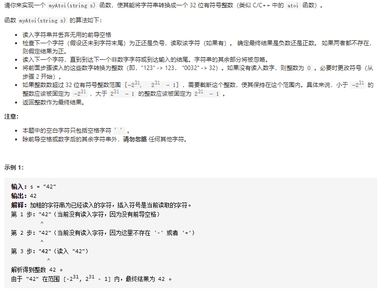
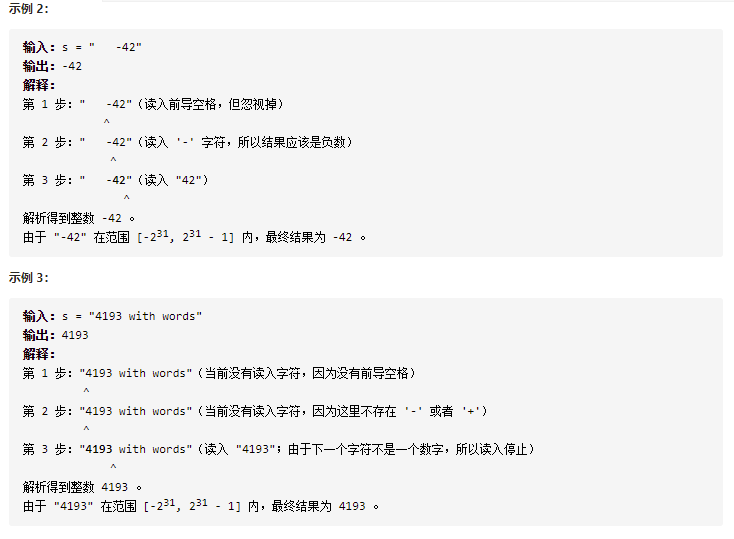
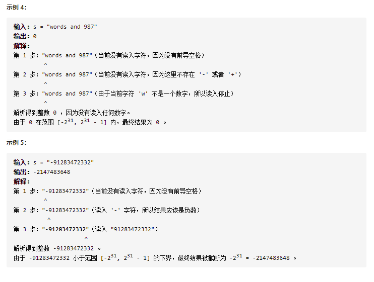

# [字符串转换整数 (atoi)](https://leetcode-cn.com/problems/string-to-integer-atoi/)







```
class Solution {
    public int myAtoi(String s) {

        s = s.trim();

        int ans = 0;
        int flag = 1; // 标记正负号
        int range = 0;// 判断是否越过范围了
        int ischar = 0; //判断第一个字符是否为数字，或者第一个字符为正负号，第二个字符为数字
        int hnumber = 0;

        for(Character c:s.toCharArray()) {

            if(ans == 0 && (!(c <= '9' && c >= '0') && c!='+' && c!='-') && ischar == 0){
                return 0;
            }else if(ans == 0 && (c=='+' || c=='-') && ischar == 0 && hnumber == 0) {
                ischar = 1;
                if(c == '-')
                    flag = -1;
                continue;
            }
            else if(ans == 0 && ischar == 1&& (!(c <= '9' && c >= '0')))
                return 0;

            if(Character.isDigit(c)) {
                hnumber = 1;
                if(ans == 0 && c == '0'){
                    continue;
                }else {
                    if(ans > Integer.MAX_VALUE/10 || ans < Integer.MIN_VALUE/10 ||
                            (ans == Integer.MAX_VALUE/10) && (c - '0') > 7 ||
                            (ans == Integer.MIN_VALUE/10) && (c - '0') < -8){
                        range = 1;
                        break;
                    }
                    ans = ans*10 + (c - '0');
                }
            }else if(hnumber == 1) {
                break;
            }
        }
        if(range == 1){
            return flag < 0?Integer.MIN_VALUE:Integer.MAX_VALUE;
        }
        return ans*flag;
    }
}
```

