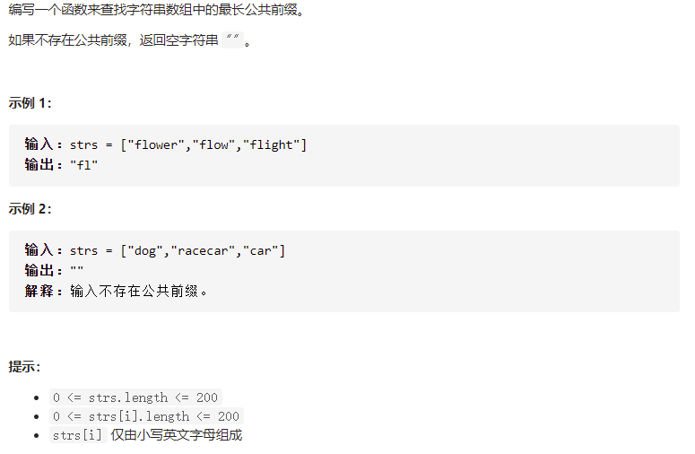

# [最长公共前缀](https://leetcode-cn.com/problems/longest-common-prefix/)



```
class Solution {
    public String longestCommonPrefix(String[] strs) {
        if(strs.length == 1) return strs[0];
        StringBuffer s = new StringBuffer();
        int j=0;
        int flag = 0;
        while(true) {
            HashSet<Character> set = new HashSet<>();
            for (int i = 0; i < strs.length; i++) {
                if(strs[i].length() == 0 || j == strs[i].length()) {
                    flag = 1;
                    continue;
                }else {
                    set.add(strs[i].charAt(j));
                }
            }
            if(flag == 1)
                break;
            if(set.size() == 1) {
                s.append(strs[0].charAt(j));
            }
            else
                break;
            j++;
        }
//        System.out.println(s);
        return s.toString();
    }
}
```

