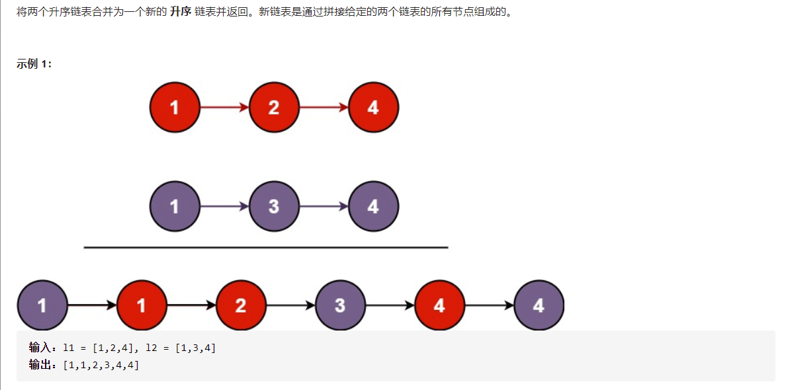
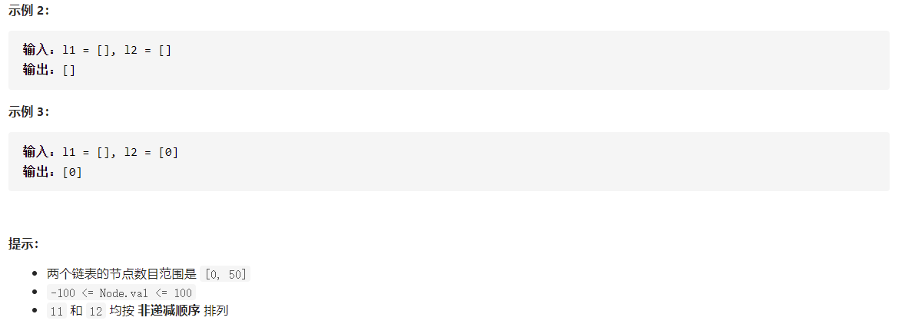

# [合并两个有序链表](https://leetcode-cn.com/problems/merge-two-sorted-lists/)





```
    public ListNode mergeTwoLists(ListNode l1, ListNode l2) {
        ListNode head,tail;
        head = tail = new ListNode();
        while(l1!=null && l2!=null){
            if(l1.val < l2.val){
                ListNode node = new ListNode(l1.val);
                tail.next = node;
                tail = node;
                l1 = l1.next;
            }else{
                ListNode node = new ListNode(l2.val);
                tail.next = node;
                tail = node;
                l2 = l2.next;
            }
        }
        while(l1!=null){
            ListNode node = new ListNode(l1.val);
            tail.next = node;
            tail = node;
            l1 = l1.next;
        }
        while(l2!=null){
            ListNode node = new ListNode(l2.val);
            tail.next = node;
            tail = node;
            l2 = l2.next;
        }
        head = head.next;
        while (head != null) {
            System.out.println(head.val);
            head = head.next;
        }
        return head;
    }
```

