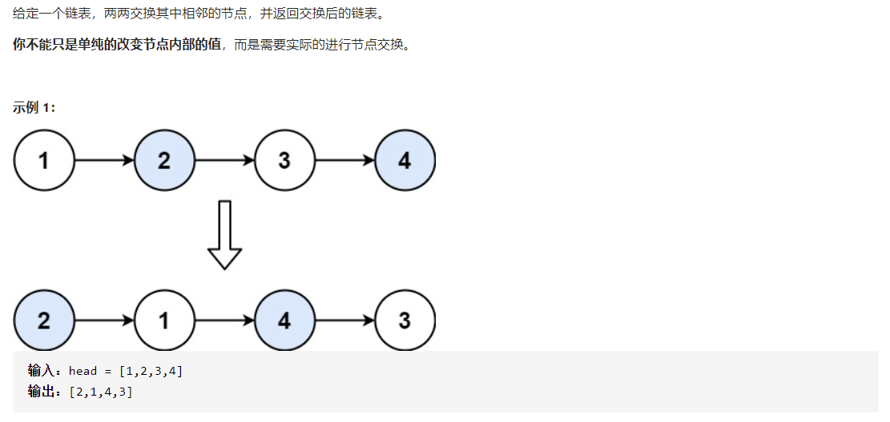
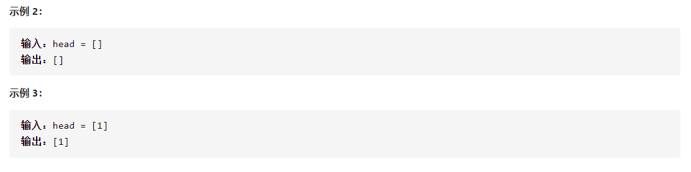

# [两两交换链表中的节点](https://leetcode-cn.com/problems/swap-nodes-in-pairs/)





```
class Solution {
    public ListNode swapPairs(ListNode head) {
        if(head == null || head.next == null){
            return head;
        }
        // System.out.println(head.val);
        ListNode next = head.next;
        head.next = swapPairs(next.next);
        next.next = head;
        return next;
    }
}
```

