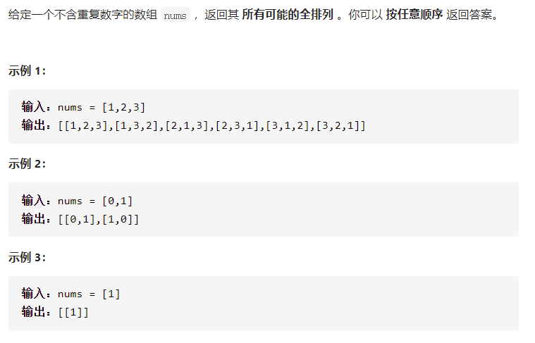

# [全排列](https://leetcode-cn.com/problems/permutations/)



```
class Solution {
  public void swap(int i,int j,int[] nums){
        int tmp = nums[i];
        nums[i] = nums[j];
        nums[j] = tmp;
    }

    public void dfs(int start,int end,int[] nums,List ans){
        if(start == end){

//            ans.add(new ArrayList(Collections.singleton(nums)));
            
            List<Integer> list = new ArrayList<>();


            for(int i=0;i<nums.length;i++){
//                System.out.println(nums[i]);
                list.add(nums[i]);
            }

//            System.out.println();

            ans.add(list);
        }else {
            for (int i=start;i<end;i++){
                swap(start,i,nums);
                dfs(start+1,end,nums,ans);
                swap(start,i,nums);
            }
        }
    }

    public List<List<Integer>> permute(int[] nums) {
        int length = nums.length;
        int[] label = new int[length];
        List<List<Integer>> list = new ArrayList<>();
        dfs(0,nums.length,nums,list);
        return list;
    }
}
```

