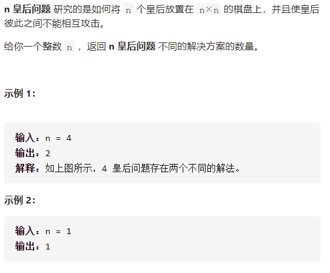

# [N皇后 II](https://leetcode-cn.com/problems/n-queens-ii/)



```
class Solution {
    public int Queens(int i, int n, int[] labels,int ans) {

        if (i == n) {
            ans++;
        }
        for (int j = 0; j < n; j++) {
            if (labels[j] == 0 && labels[i + j + n] == 0 && labels[4 * n + i - j] == 0) {
                labels[j] = 1;
                labels[i + j + n] = 1;
                labels[4 * n + i - j] = 1;
                ans = Queens(i + 1, n, labels,ans);
                labels[4 * n + i - j] = 0;
                labels[i + j + n] = 0;
                labels[j] = 0;
            }
        }
        return ans;
    }


    public int totalNQueens(int n) {
        int[] labels = new int[5 * n];
        int ans = Queens(0, n, labels,0);
        // System.out.println(ans);
        return ans;
    }
}
```

