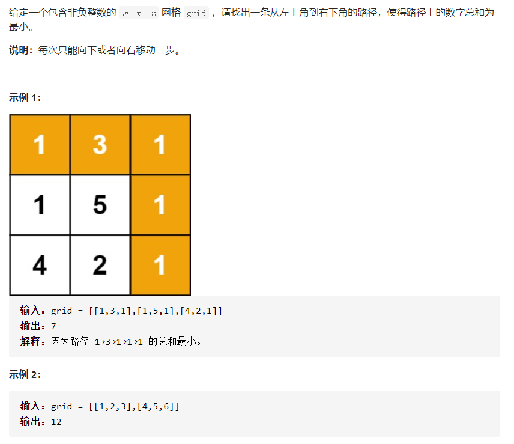

# [最小路径和](https://leetcode-cn.com/problems/minimum-path-sum/)



```
class Solution {
    public int minPathSum(int[][] grid) {
        int n = grid.length;
        int m = grid[0].length;
        int[][] df = new int[n][m];

        for(int i=0;i<n;i++){
            for(int j=0;j<m;j++){
                if(i==0 && j==0)
                    df[i][j] = grid[i][j];
                else if(j == 0)
                    df[i][j] = grid[i][j]+df[i-1][j];
                else if(i == 0)
                    df[i][j] = grid[i][j]+df[i][j-1];
                else{
                    df[i][j] = grid[i][j] + Math.min(df[i-1][j],df[i][j-1]);
                }
            }
        }
//        System.out.println(df[n-1][m-1]);
        return df[n-1][m-1];
    }
}
```

