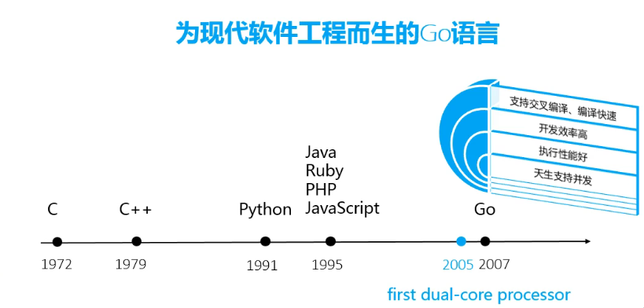
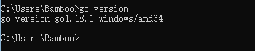
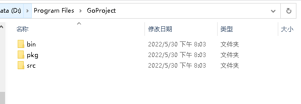
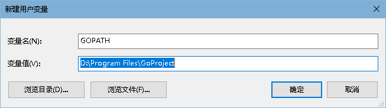
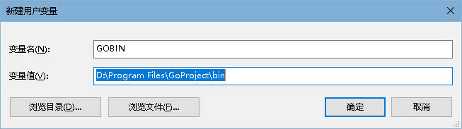
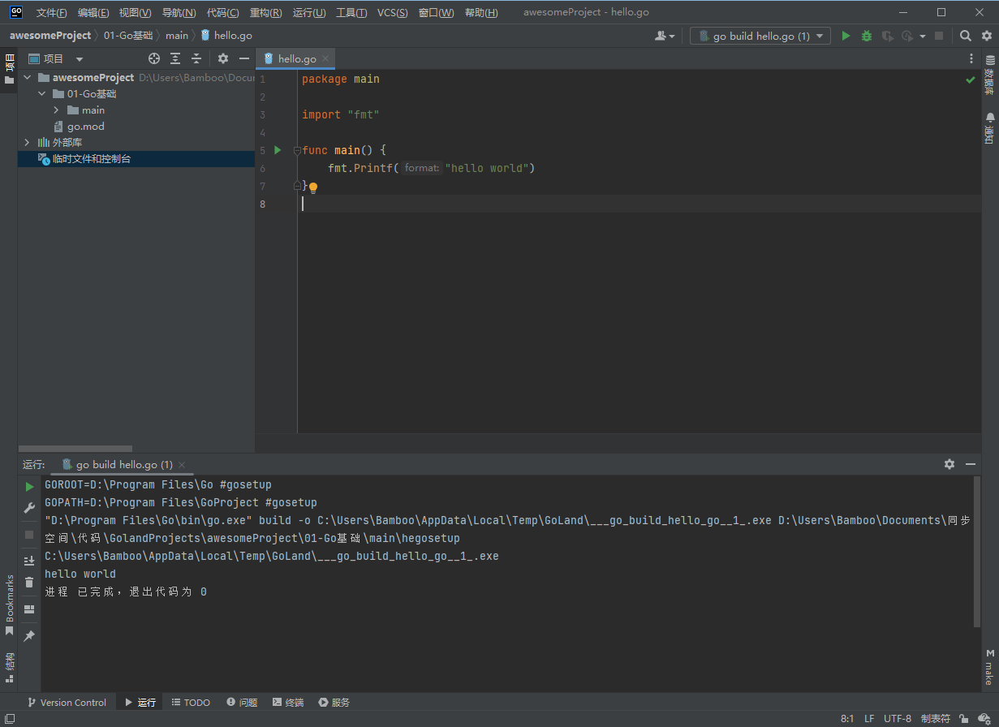

# Go基础篇

## 概述

### 什么是Go语言

* Google开源
* 编译型语言
* 21世界的C语言

### Go语言介绍




### Go语言的特点

* 语言简洁
* 开发效率高
* 执行性能好

### Go语言发展前景

目前Go语言岗位多


### 为什么要学习Go 

目前Go语言岗位多，天生支持并发，开发效率高，语法简单易学，并且薪资高。

### 环境配置

#### 安装Go

官网地址：https://go.dev/

```go
go version
```




> 安装的时候，会默认将bin目录添加到系统环境变量中。

#### 配置GOPROXY

默认GoPROXY配置是：`GOPROXY=https://proxy.golang.org,direct`，由于国内访问不到`https://proxy.golang.org`，所以我们需要换一个PROXY，这里推荐使用`https://goproxy.io`或`https://goproxy.cn`。

可以执行下面的命令修改GOPROXY：

```bash
go env -w GOPROXY=https://goproxy.cn,direct
```

#### 其他配置

##### 创建工作目录

创建`D:\Program Files\GoProject`目录，以后的编写的代码都会存放到该目录下的子目录src中。

在该目录下创建三个子目录：



* bin：go install 在编译项目时，生成的可执行文件会放到该目录
* src：存放编写的go代码
* pkg：go install 在编译项目时，生成的包文件会放到该目录

##### 配置GOPATH



##### 配置GOBIN



##### 检查环境变量

```go
go env
```

#### 第一个Go 程序：Hello World

创建`main\hello.go`

```go
package main

import "fmt"

func main() {
	fmt.Printf("hello world")
}
```

* 通过goland进行运行



* 使用`go run hello.go`运行
* 使用`go build hello.go`生成`hello.exe`可执行文件，然后运行hello.exe
* 使用`go install`会将exe文件放到bin目录中

#### 安装GoLand

官网：https://www.jetbrains.com/go/

### Go语言命名规则

Go的函数、变量、常量、自定义类型、包`(package)`的命名方式遵循以下规则：

```
1）首字符可以是任意的Unicode字符或者下划线
2）剩余字符可以是Unicode字符、下划线、数字
3）字符长度不限
```

### Go语言可见性

1. 声明在函数内部，是函数的本地值，类似private
2. 声明在函数外部，是对当前包可见(包内所有.go文件都可见)的全局值，类似protect
3. 声明在函数外部且首字母大写是所有包可见的全局值，类似public

## Go基础知识点

### Golang内置类型和函数

#### 内置类型

##### 值类型

```
bool
int(32 or 64), int8, int16, int32, int64
uint(32 or 64), uint8(byte), uint16, uint32, uint64
float32, float64
string
complex64, complex128
array    -- 固定长度的数组
```

##### 引用类型（指针类型）

```
slice   -- 序列数组(最常用)
map     -- 映射
chan    -- 管道
```

#### 内置函数

Go 语言拥有一些不需要进行导入操作就可以使用的内置函数。它们有时可以针对不同的类型进行操作，例如：len、cap 和 append，或必须用于系统级的操作，例如：panic。因此，它们需要直接获得编译器的支持。

| 内置函数名称   | 含义                                                         |
| :------------- | ------------------------------------------------------------ |
| append         | 用来追加元素到数组、slice中,返回修改后的数组、slice          |
| close          | 主要用来关闭channel                                          |
| delete         | 从map中删除key对应的value                                    |
| panic          | 停止常规的goroutine  （panic和recover：用来做错误处理）      |
| recover        | 允许程序定义goroutine的panic动作                             |
| real           | 返回complex的实部   （complex、real imag：用于创建和操作复数） |
| imag           | 返回complex的虚部                                            |
| make           | 来分配内存，返回Type本身(只能应用于slice, map, channel)      |
| new            | 用来分配内存，主要用来分配值类型，比如int、struct。返回指向Type的指针 |
| cap            | capacity是容量的意思，用于返回某个类型的最大容量（只能用于切片和 map） |
| copy           | 用于复制和连接slice，返回复制的数目                          |
| len            | 来求长度，比如string、array、slice、map、channel ，返回长度  |
| print、println | 底层打印函数，在部署环境中建议使用 fmt 包                    |

#### 内置接口error

```go
type error interface { //只要实现了Error()函数，返回值为String的都实现了err接口
    Error()    String
}
```

### Init函数和main函数

#### init函数

go语言中`init`函数用于包`(package)`的初始化，该函数是go语言的一个重要特性。

有下面的特征：

1. init函数是用于程序执行前做包的初始化的函数，比如初始化包里的变量等

2. 每个包可以拥有多个init函数

3. 包的每个源文件也可以拥有多个init函数
4. 同一个包中多个init函数的执行顺序go语言没有明确的定义(说明)
5. 不同包的init函数按照包导入的依赖关系决定该初始化函数的执行顺序
6. init函数不能被其他函数调用，而是在main函数执行之前，自动被调用

#### main函数

```go
Go语言程序的默认入口函数(主函数)：func main()
函数体用｛｝一对括号包裹。

func main(){
    //函数体
}
```

#### init函数和main函数的异同

- 相同点：
  - 两个函数在定义时不能有任何的参数和返回值，且Go程序自动调用。
- 不同点：
  - init可以应用于任意包中，且可以重复定义多个。
  - main函数只能用于main包中，且只能定义一个。

两个函数的执行顺序：

- 对同一个go文件的`init()`调用顺序是从上到下的。
- 对同一个package中不同文件是按文件名字符串比较“从小到大”顺序调用各文件中的`init()`函数。
- 对于不同的`package`，如果不相互依赖的话，按照main包中"先`import`的后调用"的顺序调用其包中的`init()`，如果`package`存在依赖，则先调用最早被依赖的`package`中的`init()`，最后调用`main`函数。
- 如果`init`函数中使用了`println()`或者`print()`你会发现在执行过程中这两个不会按照你想象中的顺序执行。这两个函数官方只推荐在测试环境中使用，对于正式环境不要使用。

### Go命令

假如你已安装了golang环境，你可以在命令行执行go命令查看相关的Go语言命令：

```sh
$ go
Go is a tool for managing Go source code.

Usage:

    go command [arguments]

The commands are:

    build       compile packages and dependencies
    clean       remove object files
    doc         show documentation for package or symbol
    env         print Go environment information
    bug         start a bug report
    fix         run go tool fix on packages
    fmt         run gofmt on package sources
    generate    generate Go files by processing source
    get         download and install packages and dependencies
    install     compile and install packages and dependencies
    list        list packages
    run         compile and run Go program
    test        test packages
    tool        run specified go tool
    version     print Go version
    vet         run go tool vet on packages

Use "go help [command]" for more information about a command.

Additional help topics:

    c           calling between Go and C
    buildmode   description of build modes
    filetype    file types
    gopath      GOPATH environment variable
    environment environment variables
    importpath  import path syntax
    packages    description of package lists
    testflag    description of testing flags
    testfunc    description of testing functions

Use "go help [topic]" for more information about that topic.
```

- go env用于打印Go语言的环境信息。
- go run命令可以编译并运行命令源码文件。
- go get可以根据要求和实际情况从互联网上下载或更新指定的代码包及其依赖包，并对它们进行编译和安装。
- go build命令用于编译我们指定的源码文件或代码包以及它们的依赖包。
- go install用于编译并安装指定的代码包及它们的依赖包。
- go clean命令会删除掉执行其它命令时产生的一些文件和目录。
- go doc命令可以打印附于Go语言程序实体上的文档。我们可以通过把程序实体的标识符作为该命令的参数来达到查看其文档的目的。
- go test命令用于对Go语言编写的程序进行测试。
- go list命令的作用是列出指定的代码包的信息。
- go fix会把指定代码包的所有Go语言源码文件中的旧版本代码修正为新版本的代码。
- go vet是一个用于检查Go语言源码中静态错误的简单工具。
- go tool pprof命令来交互式的访问概要文件的内容。

### 运算符

#### 算数运算符

| 运算符 | 描述 |
| ------ | ---- |
| +      | 相加 |
| -      | 相减 |
| *      | 相乘 |
| /      | 相除 |
| %      | 求余 |

注意： ++（自增）和--（自减）在Go语言中是单独的语句，并不是运算符。

#### 关系运算符

| 运算符 | 描述                                                         |
| ------ | ------------------------------------------------------------ |
| ==     | 检查两个值是否相等，如果相等返回 True 否则返回 False。       |
| !=     | 检查两个值是否不相等，如果不相等返回 True 否则返回 False。   |
| >      | 检查左边值是否大于右边值，如果是返回 True 否则返回 False。   |
| >=     | 检查左边值是否大于等于右边值，如果是返回 True 否则返回 False。 |
| <      | 检查左边值是否小于右边值，如果是返回 True 否则返回 False。   |
| <=     | 检查左边值是否小于等于右边值，如果是返回 True 否则返回 False。 |

#### 逻辑运算符

| 运算符 | 描述                                                         |
| ------ | ------------------------------------------------------------ |
| &&     | 逻辑 AND 运算符。 如果两边的操作数都是 True，则为 True，否则为 False。 |
| ll     | 逻辑 OR 运算符。 如果两边的操作数有一个 True，则为 True，否则为 False。 |
| !      | 逻辑 NOT 运算符。 如果条件为 True，则为 False，否则为 True。 |

#### 位运算符

位运算符对整数在内存中的二进制位进行操作。

| 运算符 | 描述                                                         |
| ------ | ------------------------------------------------------------ |
| &      | 参与运算的两数各对应的二进位相与。（两位均为1才为1）         |
| l      | 参与运算的两数各对应的二进位相或。（两位有一个为1就为1）     |
| ^      | 参与运算的两数各对应的二进位相异或，当两对应的二进位相异时，结果为1。（两位不一样则为1） |
| <<     | 左移n位就是乘以2的n次方。“a<<b”是把a的各二进位全部左移b位，高位丢弃，低位补0。 |
| >>     | 右移n位就是除以2的n次方。“a>>b”是把a的各二进位全部右移b位。  |

#### 赋值运算符

| 运算符 | 描述                                           |
| ------ | ---------------------------------------------- |
| =      | 简单的赋值运算符，将一个表达式的值赋给一个左值 |
| +=     | 相加后再赋值                                   |
| -=     | 相减后再赋值                                   |
| *=     | 相乘后再赋值                                   |
| /=     | 相除后再赋值                                   |
| %=     | 求余后再赋值                                   |
| <<=    | 左移后赋值                                     |
| >>=    | 右移后赋值                                     |
| &=     | 按位与后赋值                                   |
| l=     | 按位或后赋值                                   |
| ^=     | 按位异或后赋值                                 |

### 下划线

“_”是特殊标识符，用来忽略结果。

#### 下划线在import中

```
 在Golang里，import的作用是导入其他package。
```

　　 import 下划线（如：``import _ "./hello"``）的作用：当导入一个包时，该包下的文件里所有init()函数都会被执行，然而，有些时候我们并不需要把整个包都导入进来，仅仅是是希望它执行init()函数而已。这个时候就可以使用 `import _ `引用该包。即使用【import _ 包路径】只是引用该包，仅仅是为了调用init()函数，所以无法通过包名来调用包中的其他函数。 示例：

代码结构

```go
    src 
    |
    +--- main.go            
    |
    +--- hello
           |
            +--- hello.go
package main

import _ "./hello"

func main() {
    // hello.Print() 
    //编译报错：./main.go:6:5: undefined: hello
}
```

hello.go

```go
package hello

import "fmt"

func init() {
    fmt.Println("imp-init() come here.")
}

func Print() {
    fmt.Println("Hello!")
}
```

输出结果：

```
    imp-init() come here.
```

####  下划线在代码中

```go
package main

import (
    "os"
)

func main() {
    buf := make([]byte, 1024)
    f, _ := os.Open("/Users/***/Desktop/text.txt")
    defer f.Close()
    for {
        n, _ := f.Read(buf)
        if n == 0 {
            break    

        }
        os.Stdout.Write(buf[:n])
    }
}
```

解释1：

```
下划线意思是忽略这个变量.

比如os.Open，返回值为*os.File，error

普通写法是f,err := os.Open("xxxxxxx")

如果此时不需要知道返回的错误值

就可以用f, _ := os.Open("xxxxxx")

如此则忽略了error变量
```

解释2：

```
占位符，意思是那个位置本应赋给某个值，但是咱们不需要这个值。
所以就把该值赋给下划线，意思是丢掉不要。
这样编译器可以更好的优化，任何类型的单个值都可以丢给下划线。
这种情况是占位用的，方法返回两个结果，而你只想要一个结果。
那另一个就用 "_" 占位，而如果用变量的话，不使用，编译器是会报错的。
```

补充：

```go
import "database/sql"
import _ "github.com/go-sql-driver/mysql"
```

第二个import就是不直接使用mysql包，只是执行一下这个包的init函数，把mysql的驱动注册到sql包里，然后程序里就可以使用sql包来访问mysql数据库了。

## 常量和变量

### 变量

#### 变量的来历

## 基本类型

## 数组Array

## 切片Slice及其实现原理

## 指针

## Map及其实现原理

## 结构体

## 流程控制

## 函数

## 方法